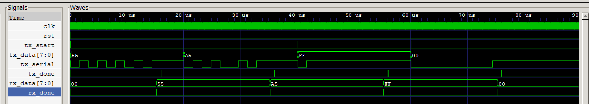

# UART Transceiver — Verilog (Simulation)

A fully functional UART (Universal Asynchronous Receiver-Transmitter) transceiver implemented in synthesizable Verilog and verified in simulation using Icarus Verilog and GTKWave.

---

## Overview

UART is a serial communication protocol used in virtually every embedded system and SoC. This implementation transmits and receives 8-bit data frames at a configurable baud rate using a pair of Moore FSMs and a shared parameterized baud rate generator. A loopback testbench verifies all four modules end-to-end by sending four bytes and checking the received data matches.

---

## Architecture

```
                     ┌─────────────┐
                     │  baud_gen   │  CLK_FREQ / (BAUD_RATE × 16)
                     │  (counter)  │──── tick ────────────────────┐
                     └─────────────┘                              │
                                                                   ▼
tx_data ──► ┌─────────────┐  tx_serial ──────────────► ┌─────────────┐ ──► rx_data
tx_start──► │   uart_tx   │  (loopback in simulation)   │   uart_rx   │
            │  (Tx FSM)   │                              │  (Rx FSM)   │ ──► rx_done
tx_done ◄── └─────────────┘                              └─────────────┘
```

---

## Module Descriptions

### `baud_gen.v`
Parameterized clock divider. Generates a single-cycle `tick` pulse at 16× the baud rate. Both Tx and Rx share the same generator — 16× oversampling allows the receiver to centre-sample each incoming bit.

```
TICKS = CLK_FREQ / (BAUD_RATE × 16)
```

| Parameter | Default | Description |
|-----------|---------|-------------|
| `CLK_FREQ` | 50,000,000 | System clock frequency (Hz) |
| `BAUD_RATE` | 9600 | Target baud rate (bits/sec) |

---

### `uart_tx.v` — Transmitter FSM

4-state Moore FSM. Serializes a byte onto `tx_serial` LSB-first with a start bit and stop bit framing.

```
IDLE ──(tx_start=1)──► START ──(16 ticks)──► DATA ──(8 bits sent)──► STOP ──► IDLE
  │                      │                     │                        │
serial=1               serial=0            serial=data[i]            serial=1
                                                                     tx_done pulse
```

- **IDLE:** line held high (idle state). Latches `tx_data` into internal register on `tx_start`.
- **START:** drives line low for one full bit-period (16 ticks). Wakes up the receiver.
- **DATA:** shifts out 8 bits LSB-first, one per bit-period.
- **STOP:** drives line high for one bit-period, then pulses `tx_done` and returns to IDLE.

---

### `uart_rx.v` — Receiver FSM

4-state Moore FSM with 16× oversampling. Detects the start bit falling edge, waits 8 ticks to centre-sample the start bit, then samples each subsequent bit at 16-tick intervals.

```
IDLE ──(rx_serial=0)──► START ──(8 ticks, verify low)──► DATA ──(8 bits)──► STOP ──► IDLE
                           │                                  │                  │
                        glitch?                         rx_shift[i]=serial    rx_data latched
                        → IDLE                                               rx_done pulse
```

- **IDLE:** monitors `rx_serial` for falling edge (start bit).
- **START:** waits 8 ticks to reach the centre of the start bit. Re-samples to reject glitches — if the line is already back high, returns to IDLE.
- **DATA:** samples `rx_serial` at the centre of each bit (every 16 ticks), stores into shift register LSB-first.
- **STOP:** waits through the stop bit, then latches the completed byte into `rx_data` and pulses `rx_done`.

The centre-sampling strategy ensures the receiver always reads each bit at its most stable point, away from bit transitions.

---

### `uart_top.v`
Top-level wrapper. Instantiates `baud_gen`, `uart_tx`, and `uart_rx`. In simulation, `tx_serial` is wired directly to `rx_serial` (loopback). In real hardware, `tx_serial` would connect to another device's `rx_serial` pin.

---

## Simulation

### Dependencies
- [Icarus Verilog](http://bleyer.org/icarus/) — open-source Verilog simulator
- [GTKWave](https://gtkwave.sourceforge.net/) — waveform viewer

### Run the loopback testbench

```bash
# Create output directory
mkdir sim

# Compile
iverilog -o sim/uart_test tb/tb_uart.v src/uart_top.v src/uart_tx.v src/uart_rx.v src/baud_gen.v

# Simulate
vvp sim/uart_test

# View waveform
gtkwave sim/dump_uart.vcd
```

### Expected terminal output
```
Sent: 0x55 | Received: 0x55 | PASS
Sent: 0xA5 | Received: 0xA5 | PASS
Sent: 0xFF | Received: 0xFF | PASS
Sent: 0x00 | Received: 0x00 | PASS
```

### Simulation waveform
The waveform below shows all four bytes transmitted and received correctly. Each byte takes one full UART frame (start bit + 8 data bits + stop bit). `rx_data` updates and `rx_done` pulses at the end of each frame.



Signals shown (top to bottom): `clk`, `rst`, `tx_start`, `tx_data`, `tx_serial` (the raw serial line), `tx_done`, `rx_data`, `rx_done`.

---

## UART Frame Format

```
Idle  Start  D0   D1   D2   D3   D4   D5   D6   D7  Stop  Idle
  1     0    b0   b1   b2   b3   b4   b5   b6   b7    1     1
        ←————————————— 10 bit periods ————————————————→
```

Each bit is held for `CLK_FREQ / BAUD_RATE` clock cycles. At 50 MHz and 9600 baud, each bit lasts approximately 104 µs.

---

## Project Structure

```
uart/
├── src/
│   ├── baud_gen.v      — parameterized baud rate generator
│   ├── uart_tx.v       — transmitter FSM
│   ├── uart_rx.v       — receiver FSM with oversampling
│   └── uart_top.v      — top-level loopback
├── tb/
│   ├── tb_uart_tx.v    — transmitter-only testbench
│   └── tb_uart.v       — full loopback testbench
├── sim/                — simulation output (VCD files)
└── README.md
```

---

## Design Decisions

**Moore FSM over Mealy:** outputs depend only on current state, not on inputs. This avoids combinational glitches on `tx_serial` and `rx_done` — critical for signal integrity on a serial line.

**Shared baud generator:** both Tx and Rx share one `baud_gen` instance running at 16× baud rate. Tx uses every 16th tick for bit timing; Rx uses the same ticks but starts counting from the centre of the start bit.

**Glitch rejection in Rx:** the START state waits 8 ticks before re-sampling `rx_serial`. If the line is already back high, the falling edge was a glitch and the FSM returns to IDLE without corrupting `rx_data`.

**rx_shift vs rx_data:** the received byte is built incrementally in `rx_shift` during DATA. Only at the end of STOP is it transferred to `rx_data`. This ensures `rx_data` always holds a complete, valid byte.
